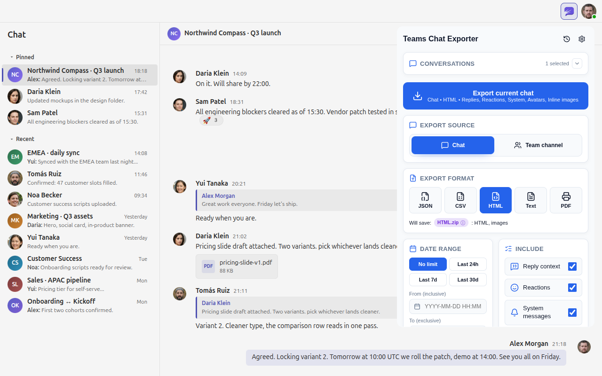

# Teams Chat Exporter

Browser extension for exporting Microsoft Teams web chat data.

Free and open source under the MIT license. It runs entirely as the signed-in user, on your own machine, with the access you already have. Nothing to install or run server-side.

Supports Chrome, Edge, and Firefox. Works with commercial, GCC High, and MCAS-proxied Teams environments.

**Live site and interactive demo: [teamschatexporter.com](https://teamschatexporter.com)**

> [!IMPORTANT]
> You are responsible for following your organization's and Microsoft's policies when exporting conversations.

## Why this exists

Teams has no built-in, on-demand way to save a single chat: its data export is a delayed, account-wide archive, and the alternatives are admin tooling you do not control or paid server-side tools. This extension does that directly: open a chat, click the icon, save a file. Good for leaving a job, handing work over, feeding chats to an LLM, or keeping your own copy.

## What it exports

- **Formats:** JSON, CSV, HTML, TXT, PDF. Pick one or several; multi-format runs come out as a single `bundle.zip`.
- **Sources:** chats and team channels, one at a time or as a multi-chat bundle (one zip, a folder per chat).
- **Per message:** text, timestamp, and author, plus forwards, mentions, reactions (with reactor names), and file metadata, wherever the format supports it.
- **Per-export options:** date range, plus toggles for replies, reactions, system messages, avatars, and inline images.
- **Inline media:** images, GIFs, and voice messages are embedded when the images toggle is on; video is linked with a thumbnail.
- **File attachments:** optionally download shared SharePoint/OneDrive files into an `attachments/` folder beside the export, with per-run size, type, and date-stamp controls.
- **History:** the popup lists this session's exports, with re-open and show-in-folder.

## How it works

The extension reads messages from the Teams Chat Service API using your existing session. If the API cannot be reached for a single chat, it falls back to reading messages off the Teams web UI as it scrolls. That fallback is a last resort: it reads only what Teams has rendered as you scroll, so it can miss older history and captures reactions, attachments, and some metadata in reduced form. It runs only when the API path is unavailable. In a multi-chat bundle, any unreachable chat is recorded in `FAILURES.txt` and the run continues; DOM fallback is off in bundle mode, since it would scrape whatever chat is on screen rather than the target. The result is built into your chosen format and saved on your machine. The extension talks only to Microsoft's own Teams and SharePoint endpoints, the ones you are already signed in to. Nothing goes to any third-party server.

## Install

  

Manual install: [docs/MANUAL_INSTALL.md](docs/MANUAL_INSTALL.md)

## Basic use

1. Open Teams on the web and open a chat or channel.
2. Click the extension icon.
3. Pick format, date range, and include options.
4. Click export.
5. Wait for the export to finish. The download starts automatically.

## Filing a bug report

If something is broken, the fastest path is to share a diagnostic report alongside your issue. See [docs/DIAGNOSTICS.md](docs/DIAGNOSTICS.md) for the steps.

## Development docs

- [docs/DEVELOPMENT.md](docs/DEVELOPMENT.md)
- [docs/ARCHITECTURE.md](docs/ARCHITECTURE.md)
- [docs/CONTRIBUTING.md](docs/CONTRIBUTING.md)
- [docs/DEPLOYMENT.md](docs/DEPLOYMENT.md)
