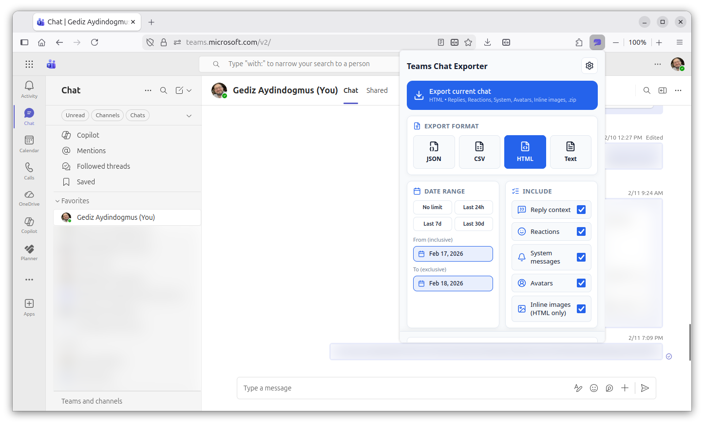

# Teams Chat Exporter

Browser extension for exporting Microsoft Teams web chat data.

Supports Chrome, Edge, and Firefox. Works with commercial, GCC High, and MCAS-proxied Teams environments.

## What it exports

- Formats: JSON, CSV, HTML, TXT, PDF (pick any one, or several together — multi-format runs are packaged as a single `bundle.zip`)
- Sources: chat conversations and team channels
- Date range filtering
- Toggleable per export: replies, reactions, system messages, avatars, inline images

Every message includes text, timestamp, and author. Forwarded messages, mentions, reactions (with reactor names when available), and file metadata (name, type, size, link) are captured where the format supports it. Files themselves are not downloaded.

Inline images, GIFs, and audio (voice messages) are embedded when the "Inline images" toggle is on. HTML embeds them via `` by default; Settings → Avatars in HTML → "Save as separate files" switches HTML output to a `.zip` that contains the HTML file plus `images/` and `avatars/` folders. PDF always embeds inline image attachments it can decode (PNG, JPEG) and rasterized Twemoji for emoji. Video thumbnails are embedded across formats; the video file itself is only linked.

HTML and JSON include the richest data. PDF offers a page-ready layout with colour emoji, clickable URLs, and avatars. CSV and TXT include the basics.

Exports completed in the session are listed on the History page inside the popup, where you can re-open the saved file or show it in its folder.

## How it works

The extension fetches messages through the Teams Chat Service API using your existing session tokens. If the API is unavailable, it falls back to scrolling the Teams web UI and reading messages from the DOM. The result is built into your chosen format and downloaded locally. No data is sent to any third-party server.

## Install

 

Manual install: [docs/MANUAL_INSTALL.md](docs/MANUAL_INSTALL.md)

## Basic use

1. Open Teams on the web and open a chat or channel.
2. Click the extension icon.
3. Pick format, date range, and include options.
4. Click export.
5. Wait for the export to finish. The download starts automatically.

## Development docs

- [docs/DEVELOPMENT.md](docs/DEVELOPMENT.md)
- [docs/ARCHITECTURE.md](docs/ARCHITECTURE.md)
- [docs/CONTRIBUTING.md](docs/CONTRIBUTING.md)
- [docs/DEPLOYMENT.md](docs/DEPLOYMENT.md)
- [docs/TODO.md](docs/TODO.md)

> [!IMPORTANT]
> You are responsible for following your organization’s and Microsoft’s policies when exporting conversations.

