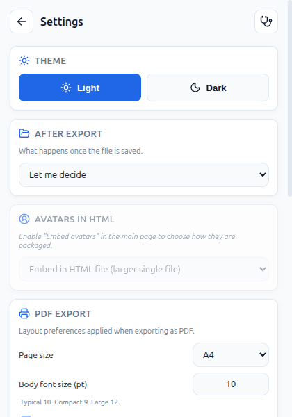
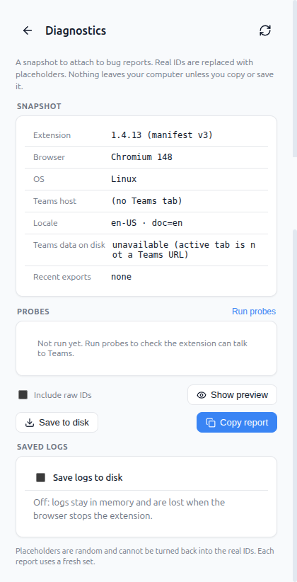

# Getting diagnostic logs

If you hit a problem with the Teams Chat Exporter and I have asked you to share diagnostic logs, this page tells you how.

The diagnostic tool builds a JSON snapshot of the extension's state plus a few active probe results. Real identifiers (UUIDs, tokens, email addresses, SharePoint tenant names) are replaced with random placeholders before you share, so the output is safe to post in a public bug report.

## 1. Install the latest GitHub release

The diagnostic page is in the latest [GitHub release](https://github.com/gediz/teams-web-chat-exporter/releases/latest), which is not on the Chrome / Edge / Firefox stores. Download the zip for your browser and follow the [manual install steps](MANUAL_INSTALL.md).

After installing you may see two extension icons in your browser (your normal store install plus the new unpacked build). Either one works for capturing diagnostics; if both are confusing, temporarily disable the store install from `chrome://extensions` or `about:addons`.

## 2. Reproduce the issue

Run the action that triggers the problem. If it is a failing export, run that export.

## 3. Open the Diagnostics page

Open the extension popup, click the gear icon to open Settings, then click the small stethoscope icon in the top right corner of the Settings page header.

## 4. Run probes

Click "Run probes". A checklist appears with active checks for Teams origin recognition, host reachability, token extraction, and the page-world helper. Wait a few seconds for the rows to populate.

## 5. Save the report

Click "Save to disk". The page writes a `.json` file to your downloads folder. The filename looks like `teams-exporter-diagnostic-2026-05-21T11-44-52.json`.

## 6. Share the file

Drag the saved `.json` file into the GitHub issue comment box (or use the paperclip / "Attach files" button below it).

---

## When to enable log persistence

If I have asked you to capture logs across more than one attempt of the same action (for example, "run the export twice and share the diagnostic"), enable log persistence before you reproduce. Without it, the in-memory log buffer is short-lived and the second attempt overwrites the first.

To enable: on the Diagnostics page, toggle "Save logs to disk" on. Then run the action the number of times I asked, and only then save and share the report.

## When to capture two reports (with / without something)

Some issues only happen under a specific condition (a corporate proxy, a feature toggle, a network environment). I may ask you to share two reports: one with the condition active and one without. Repeat steps 2 through 6 for each state, then drop both `.json` files into the same issue reply.

---

## What ends up in the file

- Browser, OS, extension version, locale.
- Your extension settings.
- Permissions granted to the extension.
- A list of Teams-related databases on your disk, with row counts only. No record content.
- A summary of your last few exports: counts, timestamps, formats. No chat content.
- Console log lines from the extension's background and content scripts.
- Probe results.

## What does not end up in the file

- Your chat messages.
- Other people's names, email addresses, or contact details (replaced with placeholders if they appear in log lines at all).
- Authentication tokens (replaced with hashed placeholders).
- The actual contents of Teams' local databases (only the database and store names).

Identifier-shaped substrings that do appear in log lines (UUIDs, Skype MRIs, email addresses, Teams thread IDs, AMS object IDs, SharePoint tenant subdomains, user slugs, regional hostnames, JWTs) are replaced with random placeholders of the form `<kind a1b2c3d4>`. Each report uses a fresh random salt, so two reports never share the same placeholders even if they describe the same data.

If something in the file still looks too sensitive to share in a public issue, open it in any text editor and edit the part you do not want to share. The JSON is plain text. Or share it with me privately by email or DM.
